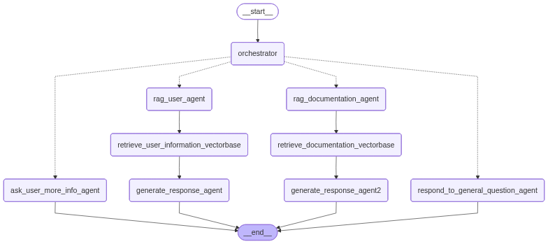

# Thread - Multi-Agent LangGraph Workflow

A sophisticated multi-agent system built with LangGraph that intelligently routes and processes user queries across different specialized agents. The system includes comprehensive evaluation frameworks, Weave tracing, and advanced RAG capabilities.



## 🏗️ Architecture Overview

This project implements a multi-agent workflow that intelligently routes user queries to specialized agents based on query classification. The system consists of:

- **Orchestrator Agent**: Routes queries to appropriate specialized agents
- **User Information Agent**: Handles user account and contact information queries
- **Documentation Agent**: Processes technical documentation and feature questions
- **General Question Agent**: Politely declines general questions outside scope
- **More Info Agent**: Requests clarification for incomplete queries

### Agent Flow Types

1. **User Flow** - User information retrieval (contact, billing, account details)
2. **Documentation Flow** - Technical documentation and feature questions
3. **General Flow** - General questions (politely declined)
4. **More Info Flow** - Incomplete queries requiring clarification

## 🚀 Features

- **Intelligent Query Routing**: AI-powered classification of user queries
- **Specialized Agents**: Each agent optimized for specific query types
- **RAG Integration**: Retrieval-Augmented Generation for accurate responses
- **Vector Search**: ChromaDB integration for knowledge base queries
- **Weave Tracing**: Comprehensive observability and evaluation
- **Streamlit Chat UI**: User-friendly web interface for interaction
- **Sophisticated Evaluation**: Multi-metric evaluation framework
- **Modular Design**: Easy to extend and customize
- **Memory**: Integrated with InMemory chat history to provide conversational chat support
- **History Cleanup**: Message history cleanup after 5 (or configurable) messages
- **Chunking**: Markdown Chunking for improved chunking of documents

## 📋 Prerequisites

- Python 3.12.11 or higher
- OpenAI API key
- Google API key (optional, for Gemini models)
- Weights & Biases (Wandb) API key for tracing
- UV package manager (recommended)

## 🛠️ Installation

### 1. Clone the Repository

```bash
git clone git@github.com:sharma-harish/thread.git
cd Thread
```

### 2. Install Dependencies

Using UV (recommended):
```bash
uv sync
```

Or using pip:
```bash
pip install -e .
```

### 3. Environment Configuration

Create a `.env` file in the project root:

```bash
# Required
openai_api_key=your_openai_api_key_here
openai_model_name=your_wandb_api_key_here

# Optional (for Google models)
google_api_key=your_google_api_key_here

# Model Configuration (optional)
embeddings_model_name=text-embedding-ada-002
google_model_name=gemini-2.5-flash
google_embeddings_model_name=gemini-embedding-001
use_google=true
wandb_api_key=wandb_api_key
```

### 4. Knowledge Base Setup

The system uses a knowledge base located in the `knowledge-base/` directory. The structure should include:

```
knowledge-base/
├── documentation/
│   └── weave.md
└── users/
    ├── user1.md
    ├── user2.md
    └── ...
```

## 🏃‍♂️ Running the Application

### Streamlit Chat Interface (Recommended)

The easiest way to interact with the multi-agent system is through the Streamlit chat interface:

```bash
# Launch the basic chat interface
python launch_streamlit.py

# Or run directly
streamlit run streamlit_app.py

# Launch the advanced dashboard
streamlit run streamlit_app.py
```

### Streamlit Interface Features

The Streamlit applications provide:

**Chat Interface (`streamlit_app.py`):**
- Simple chat interface with message history
- Flow type indicators
- Clean, responsive design
- Clear chat history feature

### Using the Graph

```python
from src.langgraph_project.main import get_or_create_graph

# Get singleton graph instance
graph = get_or_create_graph()

# Execute a query
result = graph.invoke({
    "messages": [("user", "What is Carol Johnson's contact number?")]
})
print(result)
```

### Streaming Execution

```python
from src.langgraph_project.main import get_or_create_graph

graph = get_or_create_graph()

# Stream results
events = graph.stream({
    "messages": [("user", "How do I set up LLM call traces?")]
}, stream_mode="values")

for event in events:
    print(event)
```

## 🧪 Evaluation Framework

The project includes a sophisticated evaluation system for testing agent performance:

### Weave Evaluation

```bash
python weave_evaluation.py
```

## 📊 Evaluation Metrics

The evaluation system provides comprehensive metrics:

- **Flow Classification Accuracy**: How well queries are routed to correct agents
- **Response Quality**: LLM-based scoring of response accuracy and relevance
- **Entity Extraction**: Accuracy of named entity recognition and extraction

### Flow-Specific Evaluations

- **User Flow**: Entity extraction, privacy compliance, information accuracy
- **Documentation Flow**: Technical accuracy, completeness, clarity
- **General Flow**: Politeness, boundary respect, redirection quality
- **More Info Flow**: Clarification quality, question relevance

## 🔧 Configuration

### Agent Configuration

The system uses `AgentsConfiguration` for centralized LLM settings:

```python
from src.langgraph_project.agents.configuration import AgentsConfiguration

# Access the configured LLM
llm = AgentsConfiguration.llm
```

### Vector Store Configuration

Vector store settings are managed in `src/langgraph_project/vector_store/`:

- `loader.py`: Document loading and processing
- `index.py`: Vector indexing and search

### Settings Management

All settings are managed through `src/langgraph_project/settings.py` using Pydantic:

```python
from src.langgraph_project.settings import settings

# Access settings
api_key = settings.openai_api_key
model_name = settings.openai_model_name
```

## 📁 Project Structure

```
Thread/
├── src/
│   └── langgraph_project/
│       ├── agents/
│       │   ├── agents.py          # Agent implementations
│       │   ├── configuration.py   # LLM configuration
│       │   └── prompts.py         # System prompts
│       ├── evaluation/
│       │   ├── evaluator.py       # Main evaluation entry point
│       │   ├── multi_agent_evaluator.py  # Core evaluation framework
│       │   ├── flow_evaluators.py # Flow-specific evaluators
│       │   ├── evaluation_runner.py # Evaluation orchestration
│       │   └── datasets/
│       │       └── comprehensive_test_cases.json
│       ├── tools/
│       │   ├── documentation_retriever_tool.py
│       │   └── user_retriever_tool.py
│       ├── vector_store/
│       │   ├── index.py
│       │   └── loader.py
│       ├── chroma_db/             # Vector database storage
│       ├── img/
│       │   └── graph.png          # Graph visualization
│       ├── main.py               # Main application entry point
│       ├── state.py              # State management
│       ├── settings.py           # Configuration management
│       └── utils.py              # Utility functions
├── knowledge-base/               # Knowledge base documents
├── tests/                       # Test files
├── pyproject.toml              # Project dependencies
└── README.md                   # This file
```

## 🧵 Weave Integration

The system includes comprehensive Weave integration for observability:

```python
import weave

# Initialize Weave
weave.init('iams-harish-na/thread')

# Trace execution with attributes
with weave.attributes({"my_awesome_attribute": "value"}):
    result = graph.invoke({"messages": [("user", "your query")]})
```

### Weave Features

- **Execution Tracing**: Complete workflow execution tracking
- **Evaluation Metrics**: Automated evaluation and scoring
- **Performance Monitoring**: Execution time and resource usage
- **Dashboard Integration**: Visual analysis and reporting

## 🎯 Usage Examples

### User Information Query

```python
graph = get_or_create_graph()

# Query user information
result = graph.invoke({
    "messages": [("user", "What is John Doe's account number?")]
})

# Expected flow: user -> rag_user_agent -> retrieve_user_information_vectorbase -> generate_response_agent
```

### Documentation Query

```python
# Query documentation
result = graph.invoke({
    "messages": [("user", "How can I define an evaluation model in Weave?")]
})

# Expected flow: documentation -> rag_documentation_agent -> retrieve_documentation_vectorbase -> generate_response_agent
```

### General Question (Should be Declined)

```python
# General question
result = graph.invoke({
    "messages": [("user", "What's the weather like today?")]
})

# Expected flow: general -> respond_to_general_question_agent (politely declines)
```

### Incomplete Query (Requests More Info)

```python
# Incomplete query
result = graph.invoke({
    "messages": [("user", "What is Carol's contact information?")]
})

# Expected flow: more-info -> ask_user_more_info_agent (asks for clarification)
```

## 🔍 Troubleshooting

### Common Issues

1. **Import Errors**: Ensure you're running from the project root directory
2. **API Key Issues**: Verify all required API keys are set in `.env`
3. **ChromaDB Errors**: Ensure the `chroma_db/` directory has proper permissions
4. **Weave Connection**: Check your WANDB_API_KEY and internet connection

### Debug Mode

Enable debug logging:

```python
import logging
logging.basicConfig(level=logging.DEBUG)
```

### Graph Visualization

The system automatically generates a graph visualization at `src/langgraph_project/img/graph.png`. This shows the complete workflow structure and agent connections.

## 🚀 Advanced Usage
### Extending the Knowledge Base

Add new documents to the `knowledge-base/` directory. The system will automatically index them using the vector store loader.